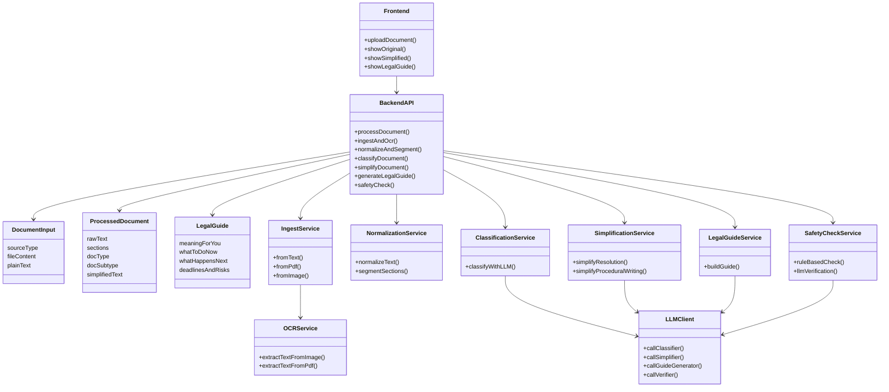

# Architecture Overview

The Justice Made Clear prototype orchestrates document understanding through distinct layers so each team can build in parallel. The backend coordinates ingestion, normalization, classification, simplification, legal guide creation, and safety checks, while the frontend focuses exclusively on user interaction.

## Processing narrative
1. **Upload & routing:** The frontend collects the document (text, PDF, or image) and calls `POST /process_document` on the backend.
2. **Ingestion + OCR:** The backend decides whether it can use the provided text or must call OCR to extract it, resulting in a normalized `ProcessedDocument` skeleton.
3. **Normalization & segmentation:** Text is cleaned, headers removed, and sections identified so downstream steps have structure.
4. **LLM classification:** The document is classified (resolution vs. procedural writing) and optionally sub-typed for prompts.
5. **Simplification:** Based on the classification branch, the system calls the LLM to produce a plain-language explanation that preserves key entities, deadlines, and outcomes.
6. **Legal guide:** A companion LLM call builds the four-block legal guide, grounding the content on the simplified text and salient sections.
7. **Safety checks:** Rule-based validators and an LLM verifier compare the original vs. simplified outputs to flag risky divergences.
8. **Response assembly:** The API bundles the doc type, subtype, simplified text, legal guide, and any safety warnings for the frontend to display.

## Pipeline flowchart
```mermaid
flowchart TD
    A[Citizen Uploads Document] --> B[POST /process_document]
    B --> C{Input Type?}
    C -->|Text| D[Use Provided Text]
    C -->|PDF| E[OCR: extractTextFromPdf]
    C -->|Image| F[OCR: extractTextFromImage]
    D --> G[Normalize & Segment]
    E --> G
    F --> G
    G --> H[LLM Classification]
    H --> I{Document Type}
    I -->|Resolution| J[Simplify Resolution]
    I -->|Procedural Writing| K[Simplify Procedural Writing]
    J --> L[Generate Legal Guide]
    K --> L
    L --> M[Safety Check (Rules + LLM)]
    M --> N[Response to Frontend]
```

## Class view

